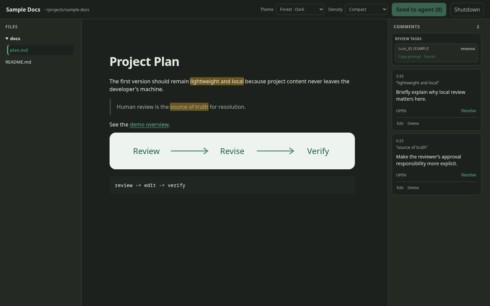

# mdreview

Review Markdown where it lives. Browse rendered documents, anchor feedback to
exact text, and hand your agent the comments to address in the next revision.

Run `mdreview .` in any project to open its review workspace in your browser.
Everything stays local, with durable comments and revision history stored beside
the project files in `.md-review`, so an agent can pick up the work without
needing your prior chat context.



## Reviewing a Markdown Workflow

1. Select a Markdown file in the project tree.
2. Select rendered text and click **Comment**.
3. Leave as many comments as needed.
4. Click **Send to agent** and copy the generated prompt.
5. Paste that prompt into an agent running in the project folder.
6. When the agent submits its candidate, inspect **Review changes**.
7. Accept an addressed comment or reopen it for another pass.

The agent edits the real Markdown source in the project. Submitting a review
task records a candidate snapshot for comparison; it is not a staging area and
does not apply or revert source changes. **View changes** remains available in
the review-task history after a task is completed.

Pending tasks can be cancelled from **Review tasks**, which releases their
comments. Comments reported as `not_addressed` or `needs_clarification` also
become available immediately for a new revision. Reopening an addressed comment
does the same.

If the clipboard contents are lost, find the pending entry under **Review
tasks** and choose **Copy prompt**. This reuses the existing task instead of
creating a duplicate.

Use the **Density** setting in the top bar to switch the rendered document
between Comfortable and Compact spacing. The browser remembers the choice.
The **Theme** setting offers Paper and Daylight light themes plus Forest,
Midnight, and Charcoal dark themes; the last choice is restored on the next
launch. **Shutdown** gracefully stops the local process and leaves a clear
confirmation in the browser tab.

Comments and review tasks are stored in `.md-review/review.json`. Baseline and
candidate snapshots used by the comparison view are content-addressed under
`.md-review/revisions/`. Before replacing valid review data, mdreview preserves
the previous state as `.md-review/review.json.backup`. If the primary JSON is
corrupt, startup stops with recovery instructions instead of overwriting it.

Markdown files larger than 5 MiB are rejected with a clear error to keep the
viewer responsive. The project tree and selected document refresh automatically
while the app is running. Relative Markdown links navigate inside the viewer,
and relative project images are served through the authenticated local process.

## Prerequisites

`mdreview` can be built from source on macOS or Linux. Building requires:

- Rust 1.86 or newer, installed with rustup
- Node.js 20.19 or newer and npm
- `make`

Node.js is needed only to build the embedded web interface. The installed
`mdreview` executable has no Node.js runtime dependency.

### macOS

Install Apple's command-line build tools, Rust, and Node.js. Homebrew is a
convenient option for Node.js; rustup remains the recommended Rust installer.

```bash
xcode-select --install
brew install node
curl --proto '=https' --tlsv1.2 -sSf https://sh.rustup.rs | sh
source ~/.cargo/env
```

### Linux

Install `make` and a C compiler using the system package manager, install a
supported Node.js release, then install Rust with rustup:

```bash
curl --proto '=https' --tlsv1.2 -sSf https://sh.rustup.rs | sh
source ~/.cargo/env
```

## Build and run

From a clone of this repository:

```bash
make build
./target/release/mdreview /path/to/project
```

Install `mdreview` on your `PATH` so the viewer and project agents can use the
same concise commands:

```bash
make install
```

`make install` places the executable in Cargo's binary directory, normally
`~/.cargo/bin`. Ensure that directory is on `PATH`, then run:

```bash
cd /path/to/project
mdreview .
```

During development:

```bash
make run PROJECT=/path/to/project
```

The process binds to a random loopback port and opens a tokenized local URL. Use
`--no-open` to print the URL without launching a browser.

Optionally install the small review-protocol block in a project's `AGENTS.md`:

```bash
cd /path/to/project
mdreview init
```

If `AGENTS.md` already exists, the command only previews the block. Re-run with
`--append` to approve adding the marked block without changing existing text.

## Agent commands

The generated prompt points the agent to these commands:

```bash
mdreview revise <task-id>
mdreview comments --open --format json
mdreview review task <task-id> --format json
mdreview review submit <task-id> --report agent-report.json
```

The copied prompt only asks the agent to run `mdreview revise <task-id>`.
That command returns the complete instructions, task metadata, anchored comments,
report format, and submission command. The lower-level `comments` and `task`
commands remain available for inspection and automation.

An agent report accounts for every requested comment ID:

```json
{
  "dispositions": [
    {
      "commentId": "C-...",
      "result": "addressed",
      "note": "Explained the privacy benefit in the revised paragraph."
    }
  ]
}
```

Allowed results are `addressed`, `not_addressed`, and
`needs_clarification`. Agent submissions never resolve comments; only the human
reviewer does that in the viewer.

## Review documents

- [Product plan](docs/PRODUCT_PLAN.md)
- [Architecture design](docs/ARCHITECTURE.md)
- [Execution plan](docs/EXECUTION_PLAN.md)
- [Generated AGENTS.md template](docs/AGENTS_TEMPLATE.md)
- [Testing and current limitations](docs/TESTING.md)

## Current design decisions

The implemented defaults are:

1. A local web app served by one small binary, not Electron.
2. Project-local, version-control-friendly review data in `.md-review/`.
3. Read-only Markdown viewing in v1; files are edited in the user's normal
   editor or by an LLM.
4. Saves never auto-resolve or delete comments.
5. Re-anchoring is conservative: ambiguous comments are shown for review rather
   than silently attached to the wrong text.
6. **Send to agent** creates a review task and copies a ready-to-paste prompt;
   v1 does not require a direct Codex or other agent integration.
7. Prebuilt platform binaries are optional convenience artifacts; macOS and
   Linux users can build the same single executable from source.
